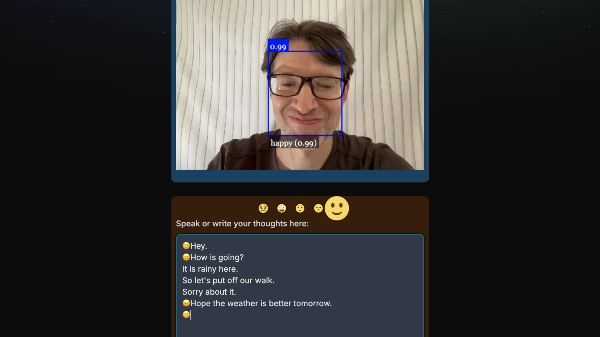

# Demo of live speech and emotions recognition

The purpose of this demo is to showcase live speech and emotion recognition, converting them into text.

## Demo features

- Capture streaming audio using [Deepgram Streaming Speech to Text](https://developers.deepgram.com/docs/getting-started-with-live-streaming-audio).
- Recognition of emotions powered by [face-api](https://justadudewhohacks.github.io/face-api.js/docs/index.html) built on top of the TensorFlow.js core API.



## Live Demo
https://speech-and-emotion-recognition.vercel.app/

## Quickstart

#### Clone the repository

Go to GitHub and [clone the repository](https://github.com/Hydraulicus/nextjs-live-transcription).

#### Install dependencies

Install the project dependencies.

```bash
npm install
```

#### Run the application

Once running, you can [access the application in your browser](http://localhost:3000).

```bash
npm run dev
```
